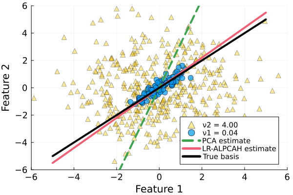

# ALPCAH: Sample-wise Subspace Learning for Heteroscedastic Data

ALPCAH/LR-ALPCAH is a method for approximating subspace bases under heteroscedastic noisy conditions.



# Model

Let $y_i \in \mathbb{R}^{D}$ denote the data samples
for index $i \in \{1,\ldots,N \}$ given $N$ total samples,
and let $D$ denote the ambient dimension.
Let $x_i$ represent the low-dimensional data sample
generated by $x_i = U z_i$
where $U \in \mathbb{R}^{D \times d}$ is an unknown subspace basis of dimension $d$
and $z_i \in \mathbb{R}^{d}$ are the corresponding basis coordinates.
Collect the measurements into a matrix
$Y = [\hspace{1mm} y_1, \ldots, y_N \hspace{1mm} ]$.
Then the heteroscedastic model we consider is
$
\begin{equation}
y_i = x_i + \epsilon_i
\quad \text{where} \quad
\epsilon_i \sim \mathcal{N}(0, \nu_i I)
\end{equation}
$
assuming Gaussian noise with variance $\nu_i$,
where $I$ denotes the $D \times D$ identity matrix.
We consider both the case where each data point may have its own noise variance,
and cases where there are
$G$ groups of data having shared noise variance terms
$\{ \nu_1,\ldots,\nu_G \}$.

In ALPCAH, we propose an optimization problem that estimates the heterogeneous noise variances $\{\nu_i\}$ and the subspace basis $U$.

# Objective Function

## ALPCAH 

Let $\Pi = \mathrm{diag}(\nu_1,\ldots,\nu_N) \in \mathbb{R}^{N \times N}$
be a diagonal matrix representing the (typically unknown) noise variances. Then, we solve:
$
\begin{equation}
    \argmin_{X,\Pi} \lambda f_{\hat{d}}(X)
    + 
    \frac{1}{2} \| (Y - X) \Pi^{-1/2} \|_F^2
    + \frac{D}{2} \log |\Pi|
\end{equation}
$
where $f_{\hat{d}}(X)$ is a novel functional that promotes low-rank structure in $X$,
$\hat{d}$ is the rank parameter,
and
$\lambda \in \mathbb{R}^{+}$ is a regularization parameter. In our work, we explore the functional:
$
\begin{equation}
f_{\hat{d}}(X) \triangleq \sum_{i=\hat{d}+1}^{\text{min}(D,N)} \sigma_i (X)
= \| X \|_* - \| X \|_{\mathrm{Ky-Fan}(\hat{d})}
\end{equation}
$
where
$\| \cdot \|_*$ denotes the nuclear norm,
and $\| \cdot \|_{\mathrm{Ky-Fan}(\hat{d})}$ denotes the Ky-Fan norm defined as the sum of the first $\hat{d}$ singular values.

## LR-ALPCAH

**This is the recommended algorithm for practioners.**

ALPCAH is computationally more expensive due to SVD 
operations each iteration (FISTA-like) 
so a matrix factorization alternative, LR-ALPCAH, happens to be much faster 
and more memory efficient algorithm while retaining similar subspace quality.
We factorize $X \in \mathbb{R}^{D \times N} \approx L R'$
where $L \in \mathbb{R}^{D \times \hat{d}}$
and $R \in \mathbb{R}^{N \times \hat{d}}$
for some rank estimate $\hat{d}$. Using the factorized form,
we propose to estimate $X$
by solving for $L$ and $R$ in the following optimization problem:
$
\begin{align}
    \hat{L}, \hat{R}, \hat{\Pi} = & \argmin_{L,R,\Pi} \ f(L,R,\Pi)
    \nonumber \\
    f(L,R,\Pi) =
    &\frac{1}{2} \| (Y - L R') \Pi^{-1/2} \|_F^2 + \frac{D}{2} \log |\Pi|
\end{align}
$
and extracting the subspace basis by doing $\hat{U} = \text{SVD}(L)$ since both matrices have the same range.

# Installation
This repo contains Julia code for ALPCAH/LR-ALPCAH tested on Julia 1.11. The dependencies for this code is quite small, our code works with basic {LinearAlgebra, Plots, Random, Distributions, Statistics} julia libraries. However, we advise to also install the TSVD package to compute partial SVDs to speed up the initialization for both algorithms.

You can run code by downloading this repo and including the files that contain code in your julia file / notebook. All code is contained in the two files below.
```julia
include("ALPCAH/alpcahFamily.jl")
include("ALPCAH/helperFunctions.jl")
```

# Usage example (from alpcahFamily.jl)

## LR-ALPCAH (unknown variance)
```julia
function LR_ALPCAH(Y::Matrix,d::Int; varfloor::Real=1e-9, alpcahIter::Int = 1000, fastCompute::Bool=false)
    """
    Returns subspace basis given data matrix Y and specified dimension of basis
    by using a matrix factorized version of ALPCAH that treats each point as
    having its own noise variance for heteroscedastic data

    Input:
    Y is DxN data matrix of N data points and ambient dimension D
    d is integer of subspace (must be known or predicted before hand)
    varfloor is opt. parameter to keep noise variances from pushing to 0
    alpcahIter is opt. integer specifing how many iterations to run the algorithm

    Optional:
    fastCompute (bool) determines whether to use partial svd method (Krylov) or
    regular compact SVD. Multithreading safe using TSVD instead of Arpack.

    Output:
    U is Dxd subspace basis of d orthonormal vectors given ambient dimension D
    """
end
```

## Rank Estimation
In some problems, you may not know the approximate rank of your data. We provide a function to estimate rank in a heteroscedastic-safe way using the SignFlipPA julia package provided by our collegue David Hong. You can estimate rank with
```julia
function estimateRank(A::Matrix; rankMethod::Symbol=:flippa, quantileAmount::Real=0.95, flipTrials::Int=10)
    """
    Estimates rank of a matrix by using methods listed

    Input:
    A is DxN matrix where D is ambient dimension and N is number of points

    Optional:
    rankMethod (symbol) can be :flippa or :eigengap. FlipPA method works
        best especially when the data is heteroscedastic. Much harder to differentiate
        signal components from noise in this setting.
    quantileAmount (real) between 0.0 and 1.0 is a quantile metric for the
        trials done in flippa. Best to leave 0.95 or 1.0 for confidence reasons.
    flipTrials (integer) describes how many trials of permutations to do
        for flippa method. Higher is better, do as many as computation time allows.

    Output:
    Integer estimate of the subspace associated with low rank matrix A
    """
end
```
